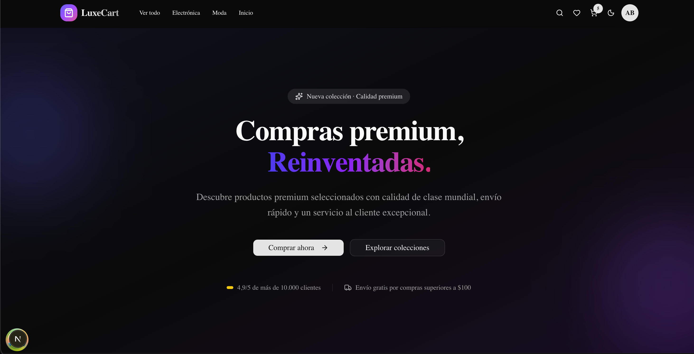
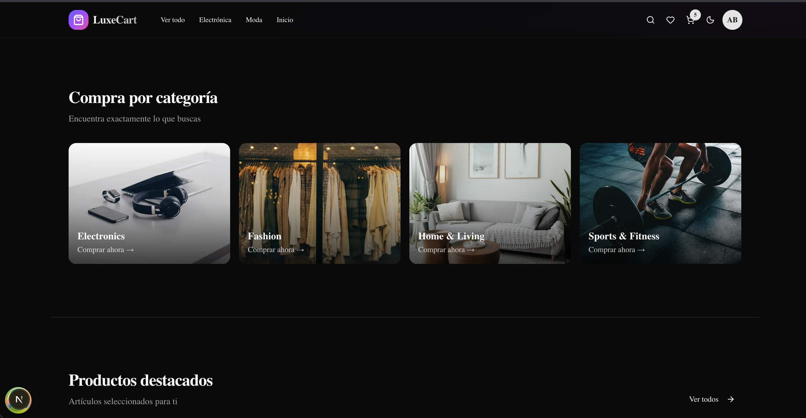
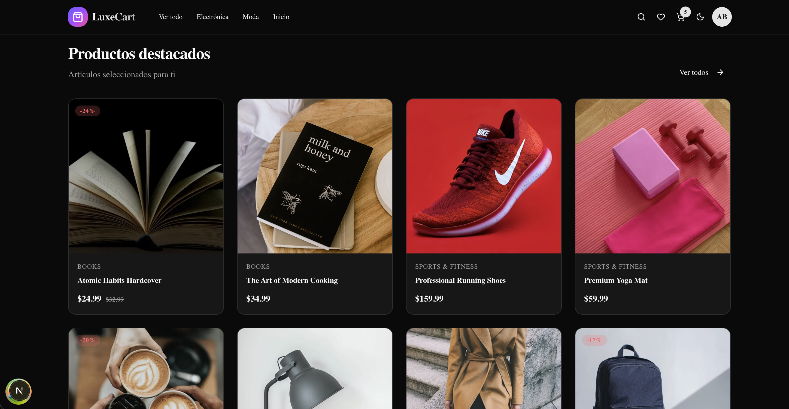
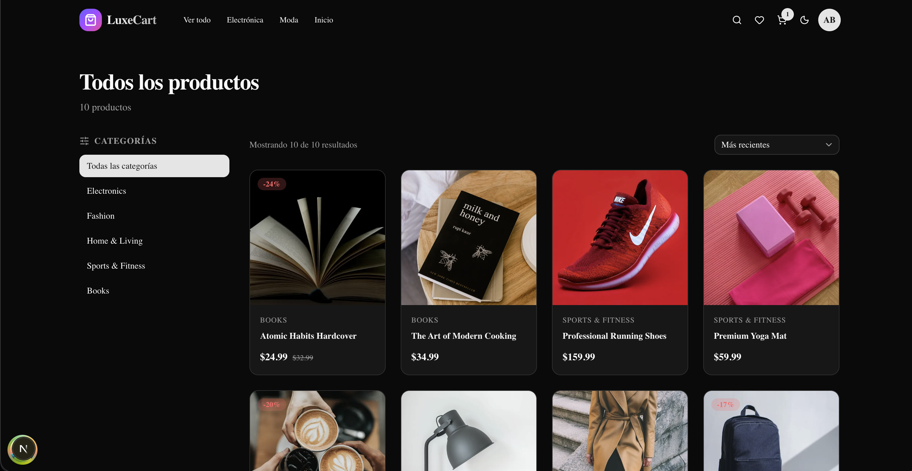
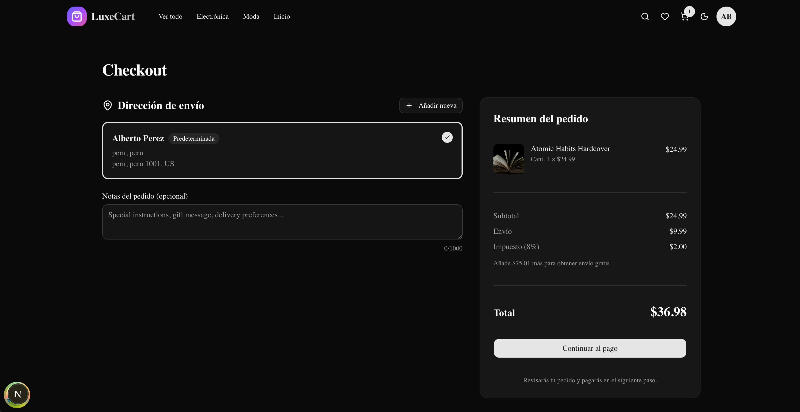

# 🛍️ LuxeCart

### Compras premium, reinventadas.

Una plataforma de e-commerce full-stack que utiliza Next.js, con procesamiento real de pagos mediante Stripe.

---

## 📋 Descripción general

LuxeCart es un e-commerce completo que demuestra prácticas modernas de ingeniería full‑stack usando Next.js. Construida de extremo a extremo con procesamiento real de pagos, ofrece una experiencia completa para el cliente, desde la exploración de productos hasta la gestión de pedidos.

### Aspectos destacados

- ✅ Pagos reales con Stripe — Checkout completo con verificación mediante webhooks
- ✅ Desplegada en producción
- ✅ Autenticación JWT — Rotación de tokens de acceso y actualización
- ✅ Arquitectura limpia — Monorepo modular con TypeScript estricto
- ✅ Lighthouse 100/100 — Accesibilidad, buenas prácticas y SEO
- ✅ Modo oscuro — Diseño adaptable y atractivo

---

## ✨ Características

### 🛒 Experiencia de compra

- Explora más de 11 productos en 6 categorías
- Filtros y ordenamiento avanzados
- Páginas detalladas de productos
- Validación de stock en tiempo real
- Carrito de compras con control de cantidades
- Gestión de lista de deseos

### 👤 Cuentas de usuario

- Registro por correo electrónico con verificación
- Autenticación JWT (tokens de acceso y actualización)
- Recuperación y restablecimiento de contraseña
- Gestión de perfil
- Libreta de direcciones (múltiples direcciones de envío)
- Historial de pedidos con seguimiento de estado

### 💳 Pagos (Stripe)

- Recolección segura de tarjetas con Stripe Elements
- Compatibilidad con 3D Secure
- Arquitectura basada en Payment Intents y webhooks
- Procesamiento idempotente de pagos
- Página de confirmación de pedido

### 🎨 UX / UI

- Diseño responsive mobile-first
- Modo oscuro con detección de preferencias del sistema
- Notificaciones tipo toast
- Skeleton loaders
- Estados vacíos con llamadas a la acción
- Transiciones suaves entre páginas

### 🛡️ Seguridad

- Encabezados de seguridad con Helmet.js
- Configuración CORS
- Limitación de tasa por IP
- Hash de contraseñas con bcrypt
- Verificación de firmas de webhooks
- Validación de entradas con Zod

---

## 📸 Screenshots de la aplicación

### Home


### Categorías


### Destacados


### Productos


### Pagar


---

## 🛠️ Stack tecnológico

### Frontend

- Next.js 16
- TypeScript 5
- Tailwind CSS 4
- shadcn/ui
- TanStack Query
- Zustand
- React Hook Form + Zod
- Stripe Elements

### Backend

- Node.js + Express.js
- TypeScript 5
- Prisma ORM
- Zod
- JWT
- bcrypt
- Stripe Node SDK
- Helmet

### Base de datos e infraestructura

- PostgreSQL 16
- Supabase
- Render
- Vercel
- UptimeRobot

### DevOps y herramientas

- Turborepo
- npm Workspaces
- ESLint + Prettier
- Git + GitHub

---

## 🚀 Inicio rápido en local

### Requisitos previos

- Node.js 18 o superior
- npm 9 o superior
- Base de datos PostgreSQL
- Cuenta de Stripe (modo de pruebas)

### Instalación

1. Clona el repositorio

```bash
git clone https://github.com/bekh4mdev/Luxecart.git
cd Luxecart
```

2. Instala dependencias

```bash
npm install
```

3. Configura las variables de entorno

4. Ejecuta las migraciones de la base de datos

```bash
cd apps/api
npx prisma migrate deploy
npx prisma db seed
```

5. Inicia los servidores de desarrollo

```bash
cd apps/api && npm run dev
cd apps/web && npm run dev
```

---

## 🎯 Hoja de ruta

### ✅ Completado

- Planificación del producto y arquitectura
- Sistema de diseño UI/UX
- Configuración del monorepo
- Diseño de base de datos
- API Backend
- Frontend
- Autenticación y seguridad
- Integración con Stripe
- Despliegue en producción
- Optimización de rendimiento

### 🔮 Mejoras futuras

- Panel de administración
- Envío real de correos electrónicos
- Interfaz de reseñas
- Compartir listas de deseos
- Soporte multidivisa
- Internacionalización
- Pruebas automatizadas
- Seguimiento en tiempo real de pedidos
- Notificaciones push

---

## 🏗️ Aspectos de arquitectura

### Flujo de petición

```text
Solicitud HTTP
     │
     ▼
[ Rutas ]
     │
     ▼
[ Middleware ]
     │
     ▼
[ Controladores ]
     │
     ▼
[ Validadores (Zod) ]
     │
     ▼
[ Servicios ]
     │
     ▼
[ Base de datos (Prisma) ]
     │
     ▼
 PostgreSQL
```

### Patrones clave

- Separación de responsabilidades
- Seguridad de tipos con TypeScript
- Idempotencia en operaciones críticas
- Seguridad transaccional
- Manejo estructurado de errores
- Servicios sin estado

---

## 🤝 Contribuciones

Este es un proyecto para mi portafolio, pero los comentarios y sugerencias son bienvenidos.

- Reporta errores mediante GitHub Issues
- Sugiere nuevas funcionalidades
- Marca el repositorio con una estrella si te resulta útil

---

## 📜 Licencia

Licencia MIT. Consulta el archivo LICENSE para más detalles.
